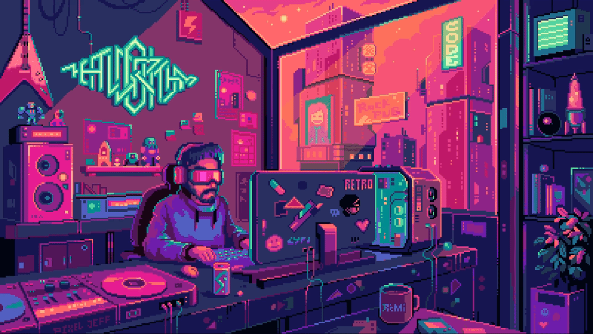

<h1 align="center">Hi 👋, I'm Sami Rhalim</h1>
<h3 align="center">Java Lover and Developer ☕️ || React.js Enthusiast ⚛️ || Kafka Streams 🔄</h3>

  

 
   

- 🔭 I’m currently working on [Portfolio](https://github.com/samyrh/Portfolio.git)  

- 🌱 I’m currently learning **Spring Boot Microservices**, **Kafka Streams**, **Message Brokers**, and **Resilience4j** *(Circuit Breakers, Retries, Rate Limiters, Bulkheads)* to design **resilient and fault-tolerant distributed systems**.  

- ⚙️ I’m working with **Java & Spring Boot Microservices** (leveraging top architecture patterns), **Kafka Streams**, **Message Brokers**, **Redis Caching**, and **Resilience4j Circuit Breaker patterns**, while also building modern frontends with **React.js**, **Angular**, and **Flutter**, and integrating **RAG (Retrieval-Augmented Generation) pipelines** and **Machine Learning models** for intelligent, data-driven applications.

- 👨‍💻 All of my projects are available at [https://github.com/samyrh](https://github.com/samyrh)  

- 💬 Ask me about **Java & Spring Framework**, **Spring Boot Microservices**, **Kafka Streams**, **Redis Caching**, **Resilience4j (Circuit Breaker patterns)**, and building modern frontends with **React.js**, **Angular**, and **Flutter**.  

- 📫 How to reach me **Rhalimsami8@gmail.com**  

- ⚡ Fun fact **Spring is named after the season to be a fresh start for developers! 🌸**  

<h3 align="left">Connect with me:</h3>

<h3 align="left">🚀 Languages & Tools</h3>

  <!-- Frontend & UI -->
  
  
  
  
  
  
  
  
  
  
  

  <!-- Backend & APIs -->

  
  
  
  
 
  
  

  <!-- Databases -->
  
  
  
  

  <!-- Messaging & Streaming -->
  
  

  <!-- ML & Data -->
  
  
  
  
  
  
  
  

  <!-- DevOps & Tools -->
  
  
  
  
  

  <!-- Design & API -->
  
  
  
  

  <!-- IDEs -->
  
  
  
  

&nbsp;

